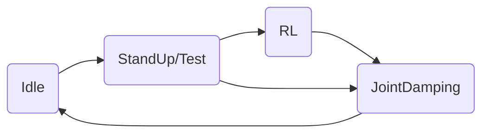
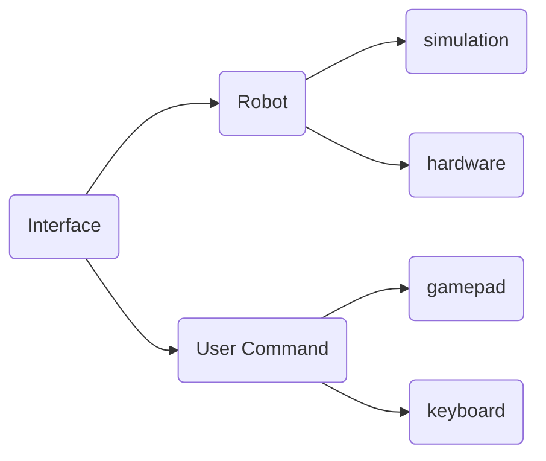

# RL_DEPLOY

## 下载编译

```bash

mkdir build && cd build
cmake .. -DBUILD_PLATFORM=arm -DSEND_REMOTE=ON 
cmake .. -DBUILD_PLATFORM=x86 -DSEND_REMOTE=OFF
cmake .. -DBUILD_PLATFORM=x86 -DSEND_REMOTE=OFF -DBUILD_SIM=ON

make -j 

```

## 各模块介绍

### state_machine




state_machine是CR1在不同的状态之间来回切换，不同的状态代表的功能如下：

1.Idle 空闲状态，表示机器狗处于关节不发力的情况

2.StandUp/Test 站起状态/测试状态，表示机器人从趴下到站起的动作

3.RL RL控制状态，表示机器狗执行策略输出的action

4.JointDamping 关节阻尼状态，表示机器狗的关节处于阻尼控制状态

### interface



interface模块表示狗的数据接收和下发接口和手柄控制的输入。其中机器狗平台的输入分为仿真和实物，手柄的输入分为键盘和手柄控制。

### run_policy


这部分用于执行RL策略的输出，新的策略可以通过继承policy_runner_base实现。


## 实机部署步骤

### 本地电脑交叉编译部署

1.准备Ubuntu系统的电脑，且系统为18.04或20.04，如果没有需要将程序scp到运动主机上编译运行。

2.在电脑上安装expect脚本解释器 

```shell
sudo apt-get install expect
```

3.连上机器人的wifi或使用有线连接

4.在本机交叉编译完毕并执行rl_deploy/scripts目录下的scp_torch_to_remote.sh脚本，注意修改脚本中定义的ip和用户名 

5.ssh [ysc@192.168.1.131]连进狗的运动主机。 

6.先执行~/dros/ecan_master/scripts/下的脚本启动系统底层程序，run.sh或restart.sh均可，出于安全考虑，推荐使用run.sh手动开启。

7.新开一个终端，ssh [ysc@192.168.1.131]连进狗的运动主机，在~/dros/rl_deploy/bin/目录下直接执行./rl_deploy。观察程序能否正常运行及相关打印，解决具体问题。实现键盘控制或者手柄控制。

### 注意
1.如果超时现象较严重，推荐进入root，执行echo performance | tee $(ls /sys/bus/cpu/devices/cpu*/cpufreq/scaling_governor)开启cpu性能模式后，再执行rl_deploy这一可执行文件
